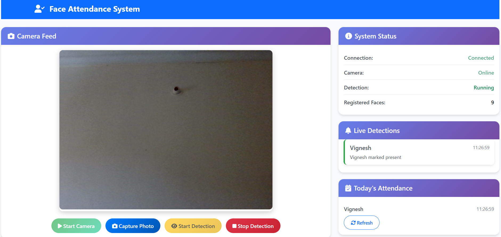
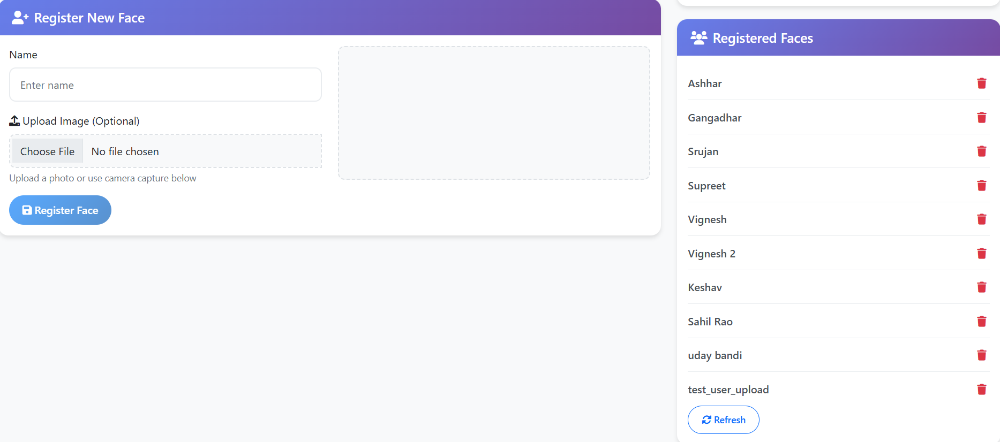

# 🎯 Face Detection Attendance System

A modern, real-time face recognition attendance system built with Python Flask and advanced computer vision technology. This system automatically detects and recognizes registered faces to mark attendance, providing a seamless and contactless attendance tracking solution.

## 📸 User Interface Screenshots

### Main Dashboard


### Registration Interface with File Upload


*The registration interface now supports both camera capture and direct file upload for maximum flexibility.*

---

## ✨ Features

- **Real-time Face Detection** with live camera feed
- **High Accuracy** using `face_recognition` (dlib)
- **Multiple Registration Methods**: Camera capture or direct file upload
- **Automatic Attendance Marking**
- **Duplicate Prevention**: 10-second cooldown
- **Daily Tracking**: Separate records for each day
- **Live Notifications** and WebSocket updates
- **Modern, Responsive UI** (Bootstrap 5)
- **Secure File Handling** and validation
- **Automatic browser launch** on app start

---

## 🛠️ Technology Stack

- **Backend**: Python Flask
- **Face Recognition**: `face_recognition` library
- **Real-time Communication**: Flask-SocketIO with Eventlet
- **Frontend**: HTML5, CSS3, JavaScript
- **UI Framework**: Bootstrap 5
- **Image Processing**: Pillow (PIL)
- **Data Storage**: JSON files

---

## 📋 Prerequisites

- [Python 3.7+](https://www.python.org/downloads/)
- [pip](https://pip.pypa.io/en/stable/installation/) (Python package manager)
- **Webcam** or camera device
- **Modern web browser** (Chrome, Edge, Firefox, etc.)
- **Internet connection** for dependencies

---

## 🚀 Installation

### Step 1: Clone the Repository
```bash
git clone <repository-url>
cd SmartAttendance-FaceID
```

### Step 2: Install Dependencies

#### For **Windows**
1. **Install [Visual Studio Build Tools](https://visualstudio.microsoft.com/visual-cpp-build-tools/)**  
   - During installation, select **"Desktop development with C++"**.
2. **Install [CMake](https://cmake.org/download/)**  
   Or via pip:
   ```bash
   pip install cmake
   ```
3. **Install Python dependencies**
   ```bash
   pip install --upgrade pip
   pip install -r requirements.txt
   pip install dlib
   pip install face_recognition
   ```

#### For **macOS**
```bash
brew install cmake
pip install --upgrade pip
pip install -r requirements.txt
pip install dlib
pip install face_recognition
```

#### For **Ubuntu/Debian**
```bash
sudo apt-get update
sudo apt-get install cmake
sudo apt-get install libopenblas-dev liblapack-dev
sudo apt-get install libx11-dev libgtk-3-dev
sudo apt-get install libboost-python-dev
pip install --upgrade pip
pip install -r requirements.txt
pip install dlib
pip install face_recognition
```

---

### Step 3: Run the Application
```bash
python app.py
```
- The application will start on [http://localhost:5000](http://localhost:5000)
- **Your browser will open automatically!**

### Step 4: Test the Application (Optional)
```bash
python test_file_upload.py   # Test file upload functionality
python test_attendance.py    # Test attendance API
```

---

## 📖 Usage Guide

### 1. **Starting the System**
- Run `python app.py` and your browser will open automatically
- Click **"Start Camera"** to initialize the webcam
- Ensure camera permissions are granted

### 2. **Registering New Faces**
#### Method 1: Camera Capture
1. Click **"Start Camera"**
2. Click **"Capture Photo"**
3. Enter the person's name
4. Click **"Register Face"**

#### Method 2: File Upload
1. Click **"Choose File"**
2. Select an image (PNG, JPG, JPEG, max 5MB)
3. Preview the image
4. Enter the person's name
5. Click **"Register Face"**
6. Use the **"Clear"** button to remove uploaded files if needed

**💡 Pro Tip:** You can switch between camera and file upload seamlessly.

### 3. **Starting Face Detection**
- Click **"Start Detection"** to begin real-time face recognition
- Attendance is marked automatically

### 4. **Monitoring Attendance**
- View real-time attendance in the "Today's Attendance" panel
- Check "Live Detections" for instant notifications
- Use "Refresh" buttons to update lists

### 5. **System Status**
- **Connection**: WebSocket status
- **Camera**: Camera feed status
- **Detection**: Face detection status
- **Registered Faces**: Count of registered faces

---

## 📁 Project Structure
```
SmartAttendance-FaceID/
├── app.py                      # Main Flask application
├── requirements.txt            # Python dependencies
├── registered_faces.json       # Stored face encodings
├── attendance.json             # Attendance records
├── UI.png                      # Main dashboard screenshot
├── UI-of-Register.png          # Registration interface screenshot
├── test_file_upload.py         # File upload functionality test
├── test_attendance.py          # Attendance API test
├── static/
│   ├── css/
│   │   └── style.css          # Custom styles
│   └── js/
│       └── app.js             # Frontend JavaScript
├── templates/
│   └── index.html             # Main HTML template
├── uploads/                   # Stored face images
└── README.md                  # This file
```

---

## 🔧 Configuration
- **Tolerance**: Adjustable in `app.py` (default: 0.5)
- **Cooldown Period**: 10 seconds between attendance marks
- **Image Formats**: PNG, JPG, JPEG
- **File Size Limit**: 5MB per image
- **Face Detection**: Requires at least one clear face in the image
- **Face Images**: Stored in `uploads/`
- **Data Files**: JSON format

---

## 🔒 Security Features
- **File Validation**: Only allowed image formats accepted
- **Secure Filenames**: Automatic filename sanitization
- **Input Validation**: Server-side validation for all inputs
- **Error Handling**: Graceful error handling and user feedback

---

## 🆕 Recent Updates
- **Direct Image Upload**: Upload images directly from your device
- **File Validation**: Automatic validation of image formats and sizes
- **Preview Functionality**: See uploaded images before registration
- **Clear Button**: Easy removal of uploaded files
- **Dual Method Support**: Seamless switching between camera and file upload
- **Enhanced UI**: Modern file upload interface
- **Error Handling**: Comprehensive error messages for invalid files
- **Automatic browser launch**: Opens your browser when you run the app

---

## 🐛 Troubleshooting

### Face Recognition/Dlib Installation Issues (Windows)
- **CMake or compiler errors?**
  - Make sure you have installed both [CMake](https://cmake.org/download/) and [Visual Studio Build Tools](https://visualstudio.microsoft.com/visual-cpp-build-tools/) (with C++ support).
  - Restart your terminal after installation.
  - Check that `cmake --version` works in your terminal.
- **Still having issues?**
  - Try installing pre-built wheels from [https://www.lfd.uci.edu/~gohlke/pythonlibs/#dlib](https://www.lfd.uci.edu/~gohlke/pythonlibs/#dlib) (advanced users).
- **General tips:**
  - Use a virtual environment:
    ```bash
    python -m venv venv
    venv\Scripts\activate  # On Windows
    source venv/bin/activate  # On macOS/Linux
    ```
  - Upgrade pip: `python -m pip install --upgrade pip`
  - If you see errors about numpy or Pillow, run `pip install numpy Pillow` before installing dlib or face_recognition.

### Other Common Issues
- **Camera Not Working**
  - Ensure camera permissions are granted
  - Check if camera is being used by another application
  - Try refreshing the page
- **Face Recognition Not Working**
  - Ensure good lighting conditions
  - Face should be clearly visible and centered
  - Check if face is properly registered
- **Performance Issues**
  - Close other applications using the camera
  - Ensure adequate system resources
  - Consider reducing camera resolution

---

## 📊 API Endpoints

### Registration
- `POST /api/register` - Register a new face (supports both file upload and base64 image)
  - **File Upload**: Send `multipart/form-data` with `file` and `name` fields
  - **Camera Capture**: Send JSON with `image` (base64) and `name` fields
- `GET /api/registered-faces` - Get list of registered faces

### Attendance
- `POST /api/attendance` - Mark attendance manually
- `GET /api/attendance-list` - Get today's attendance

### File Access
- `GET /uploads/<filename>` - Access stored images

### WebSocket Events
- `stream_frame` - Send camera frame for real-time detection
- `face_detected` - Receive detection results

---

## 🤝 Contributing
1. Fork the repository
2. Create a feature branch (`git checkout -b feature/AmazingFeature`)
3. Commit your changes (`git commit -m 'Add some AmazingFeature'`)
4. Push to the branch (`git push origin feature/AmazingFeature`)
5. Open a Pull Request

---

## 📝 License
This project is licensed under the MIT License - see the [LICENSE](LICENSE) file for details.

---

## 👨‍💻 Author
**Vignesh B S** - Developer and Maintainer

---

## 🙏 Acknowledgments
- **face_recognition** library by Adam Geitgey
- **Flask** web framework
- **Bootstrap** for responsive UI components
- **Socket.IO** for real-time communication

---

## 📞 Support
If you encounter any issues or have questions:
1. Check the troubleshooting section above
2. Review the project documentation
3. Open an issue on the repository
4. Contact the development team

---

<div align="center">

### 🎯 Face Detection Attendance System

**A modern, real-time face recognition attendance system**

---

**Developed by [Vignesh B S](https://github.com/vigneshbs33)**

[](https://github.com/vigneshbs33)
[](https://www.linkedin.com/in/vigneshbs-dev/)
[](https://vigneshbs.vercel.app/)

**© 2024 Vignesh B S. All rights reserved.**

*Empowering efficient attendance management through AI-powered face recognition*

</div> 